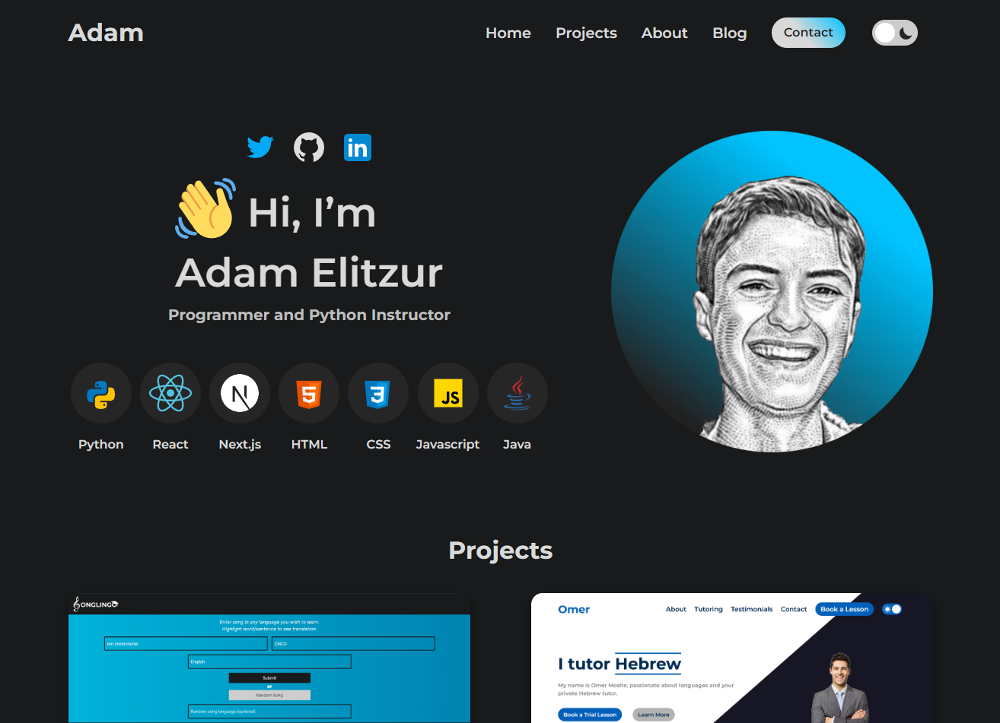

# Portfolio-Website

This is my portfolio website with an about me including what tools I know, projects, and my blog.

## Table of contents

- [Overview](#overview)
  - [Screenshot](#screenshot)
  - [Links](#link)
- [My process](#my-process)
  - [Built with](#built-with)
  - [What I learned](#what-i-learned)
- [Author](#author)

## Overview

### Screenshot

### Link

- Live Site URL: [Adam Elitzur](https://adamelitzur.com)

## My process

### Built with

- HTML
- CSS
- Flexbox
- CSS Grid
- Mobile-first development
- Javascript

### What I learned

This was the first website I fully made myself, with no premade design. I designed it in Adobe XD, and then coded it with HTML, CSS, and vanilla JS. I learned a lot about doing the whole web development process by myself.

## Author

- Website - [Adam Elitzur](https://www.adamelitzur.com)
- LinkedIn - [Adam Elitzur](https://www.linkedin.com/in/adam-elitzur/)
- Twitter - [@adamcandoit](https://twitter.com/adamcandoit)
